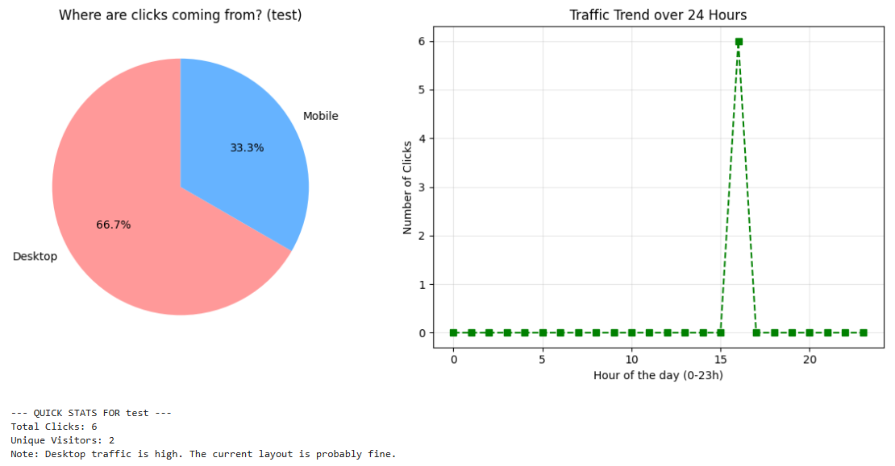

# SmartLink: Analytics & Insights Engine
**Developed for JPD HUB Hackathon | Advitiya'26**

## 📌 Project Overview
SmartLink is an intelligent telemetry and URL routing system designed to optimize digital marketing reach. This repository contains the **Analytics & Insights Module**, which processes raw user data to generate visual traffic reports and automated content strategy recommendations.

## 🛠️ Technical Stack
* **Language:** Python
* **Data Processing:** Pandas
* **Visualization:** Matplotlib
* **Database:** SQLite

## 🚀 Key Features & Implementation

### 1. Telemetry Data Processing
* Engineered a data pipeline using **Pandas** to extract and clean clickstream logs from an **SQLite** database.
* Implemented unique visitor tracking by processing MD5-hashed IP and date combinations to ensure privacy-compliant analytics.

### 2. Traffic Visualization & Behavior Analysis
* **Device Distribution:** Developed automated pie charts with **Matplotlib** to visualize user segments (Mobile vs. Desktop) based on User-Agent parsing.
* **Temporal Trends:** Generated 24-hour traffic line graphs to identify peak engagement windows for strategic link deployment.

### 3. Automated Insights Engine
* Created a rule-based logic script that evaluates real-time traffic thresholds.
* **Actionable Output:** The system automatically generates optimization suggestions, such as "High mobile traffic detected: Optimize for vertical video formats."

## 📂 Project Structure
```text
├── data/
│   └── telemetry.db          # SQLite database with raw click logs
├── analysis_dashboard.ipynb  # Main Jupyter Notebook for data processing
├── insights_engine.py        # Python script for automated recommendations
├── requirements.txt          # Project dependencies (Pandas, Matplotlib)
└── README.md                 # Project documentation

```

## 📊 Analytics Dashboard Output
The engine automatically generates a visual telemetry report from raw SQLite clickstream data:



### Key Insights from Sample Data:
* **Unique Visitor Logic:** Correcting raw click counts to identify unique visitors (demonstrating data cleaning proficiency).
* **Device Segmentation:** Visualizing the 66.7% Desktop vs. 33.3% Mobile split via Matplotlib.
* **Temporal Patterns:** Mapping peak traffic at Hour 12 to assist in content scheduling.
* **Automated Logic:** The bottom panel shows the rule-based AI suggestion based on the current audience health.

## 🏆 Recognition
* **Participation Certificate:** Awarded for successful completion and presentation of the SmartLink project at **Advitiya '26**.
* [View Official Certificate](https://drive.google.com/file/d/1wqpo2Ea2bOSGBqOdbErOUdqrzHCDqFzA/view?usp=sharing)
